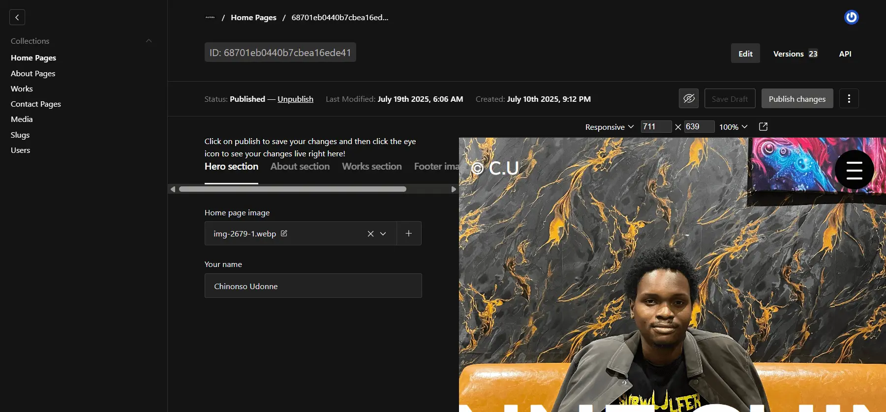

# Archfolio ✨  
**Create and manage your own portfolio site in minutes. Built for architecture students, creatives, and anyone who wants to showcase their work — effortlessly.**



---

## 🚀 Overview

**Archfolio** is a dynamic web-based platform designed to help students and design professionals create personalized portfolio websites — no coding required. With a clean dashboard, rich content editor, and mobile-optimized layouts, users can update their site in real-time and share a custom link with recruiters, collaborators, or the world.

This is a **full-stack web application** built with [Payload CMS 3.0](https://payloadcms.com), [Next.js 15](https://nextjs.org), and Tailwind CSS.

---

## 🧠 Features

- 🌐 **Instant Portfolio Generation** — Just sign up, fill in your details, and your portfolio is live.
- 🖼️ **Project & Bio Management** — Add and update work, education, and personal info with ease.
- 📱 **Responsive & Mobile-Ready** — Designed to look great on every screen.
- 🔐 **Secure Architecture** — Built using modern security practices; your data stays private.
- 🛠️ **Powered by Payload CMS** — Headless CMS with a custom multi-tenant backend.
- ☁️ **Image Hosting with Cloudinary** — Seamless media upload and rendering.
- ✨ **Beautiful UI/UX** — Built with TailwindCSS, Framer Motion, and a focus on clean design.
- 💬 **Email Integration** — Uses Nodemailer for user notifications.

---

## 🏗️ Tech Stack

- **Frontend:** React 19, Next.js 15, Tailwind CSS, Framer Motion  
- **Backend:** Payload CMS 3.0 (Multi-Tenant Enabled), MongoDB  
- **UI Libraries:** shadcn/ui, Lucide React, Radix UI  
- **Authentication:** Payload Auth  
- **Email:** Gmail API, Nodemailer
- **Hosting:** Vercel
- **Testing:** Playwright, Vitest  
- **Build Tools:** Vite, PostCSS, ESLint, Prettier  
- **Others:** Cloudinary, dotenv, Yup, Formik, next-themes

---

## 📦 Installation

```bash
git clone https://github.com/nonso-uj/archfolio.git
cd archfolio
pnpm install
````

---

## 🧪 Development

### Start Dev Server:

```bash
pnpm dev
```

### Safe Dev (clears `.next` cache first):

```bash
pnpm devsafe
```

### Generate Payload Types:

```bash
pnpm generate:types
```

### Generate Payload Importmap:

```bash
pnpm generate:importmap
```

### Run Tests:

```bash
pnpm test
```

---

## 🧩 Scripts

| Command               | Description                            |
| --------------------- | -------------------------------------- |
| `pnpm dev`            | Start the development server           |
| `pnpm devsafe`        | Clean `.next` folder before dev        |
| `pnpm build`          | Build the production app               |
| `pnpm start`          | Start the production server            |
| `pnpm generate:types` | Generate Payload TypeScript types      |
| `pnpm lint`           | Run linter                             |
| `pnpm test`           | Run all tests (e2e + unit)             |
| `pnpm test:int`       | Run unit/integration tests with Vitest |
| `pnpm test:e2e`       | Run end-to-end tests with Playwright   |

---

## 🛡️ Security

* Payload uses encrypted sessions and secure token handling.
* MongoDB connections use `dotenv`-based environment variables.
* Payload access control is configured per collection.
* Multi-tenant support ensures user data is isolated and protected.
* No public write access to user data endpoints.

---

## 📁 File Structure (Simplified)

```
/src
  /app         ← Next.js frontend
  /cms         ← Payload CMS config
  /components  ← Reusable UI elements
  /utils       ← Utility functions
  /tests       ← Vitest & Playwright
```

---

## 📄 License

MIT License © \[Your Name]
You are free to fork, modify, and use as needed.

---

## 🙌 Acknowledgements

* [Payload CMS](https://payloadcms.com)
* [Next.js](https://nextjs.org)
* [TailwindCSS](https://tailwindcss.com)
* [Cloudinary](https://cloudinary.com)

---

## 🌐 Live Demo

> [Archfolio live website](https://archfolio-two.vercel.app)

---

## 👋 Want to contribute or give feedback?

Feel free to [open an issue](https://github.com/nonso-uj/archfolio/issues) or reach out via [LinkedIn](https://www.linkedin.com/in/nonso-uj).
